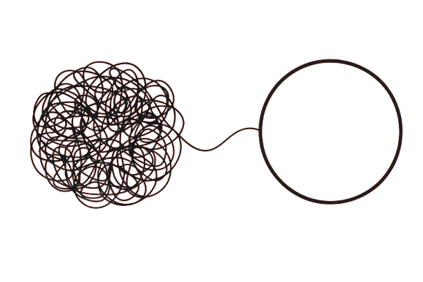

<p align="center">
  
</p>

<h1 align="center">Entenda Aqui</h1>

<p align="center">
  <strong>Transformando documentos jurídicos complexos em linguagem simples e acessível para todos os cidadãos brasileiros.</strong>
</p>

<p align="center">
  <a href="https://www.python.org/downloads/"></a>
  <a href="https://flask.palletsprojects.com/"></a>
  <a href="https://ai.google.dev/"></a>
  <a href="#-lgpd--privacidade"></a>
  <a href="https://render.com"></a>
</p>

<p align="center">
  <a href="#-sobre-o-projeto">Sobre</a> •
  <a href="#-funcionalidades">Funcionalidades</a> •
  <a href="#-como-funciona">Como Funciona</a> •
  <a href="#-instalação">Instalação</a> •
  <a href="#-deploy">Deploy</a> •
  <a href="#-api-endpoints">API</a> •
  <a href="#-lgpd--privacidade">LGPD</a>
</p>

---

## Sobre o Projeto

O **Entenda Aqui** é uma aplicação web desenvolvida pela **INOVASSOL - Centro de Inovação AI** que utiliza inteligência artificial do Google Gemini para simplificar documentos jurídicos complexos — sentenças, mandados, acórdãos, despachos e outros — transformando-os em linguagem clara, objetiva e acessível ao cidadão comum.

### O Problema

Milhões de brasileiros recebem documentos jurídicos todos os dias e não conseguem compreender seu conteúdo. A linguagem técnica do Direito cria uma barreira que impede o cidadão de entender seus próprios direitos e obrigações.

### A Solução

O Entenda Aqui recebe o documento jurídico (PDF, imagem ou texto), processa com IA e entrega:

- Um **resumo claro** do que o documento diz
- A **identificação do resultado** (vitória, derrota, parcial, pendente)
- Os **valores e prazos** extraídos automaticamente
- Um **glossário** dos termos jurídicos usados
- Uma **explicação personalizada** com base no papel do usuário (autor ou réu)
- **Indicadores de urgência** para documentos com prazos críticos
- Um **PDF simplificado** para download com marca d'água anti-fraude

---

## Funcionalidades

### Processamento de Documentos

| Recurso | Descrição |
|---------|-----------|
| **Upload de PDF** | Extração de texto via PyMuPDF com fallback para OCR |
| **Upload de Imagens** | Suporte a PNG, JPG, GIF, BMP, TIFF, WEBP com OCR Tesseract |
| **Texto Manual** | Cole o texto jurídico diretamente na interface (endpoint `/processar_texto`) |
| **Documentos Digitalizados** | OCR automático com pré-processamento de imagem (contraste, escala de cinza) |

### Inteligência Artificial

| Recurso | Descrição |
|---------|-----------|
| **Multi-Modelo** | Sistema de fallback com 4 modelos Gemini em cascata |
| **Perspectiva Personalizada** | Explicação adaptada para autor, réu ou caso ECA |
| **Detecção de Segredo de Justiça** | Bloqueio automático de documentos sigilosos (exceto mandados e intimações) |
| **Validação Judicial** | Aceita apenas documentos emitidos pelo Poder Judiciário — bloqueia petições e reclamações trabalhistas |
| **Perguntas Sugeridas** | Sugestões contextuais baseadas no tipo de documento |

### Segurança e Proteção Anti-Abuso

| Recurso | Descrição |
|---------|-----------|
| **Validação de CPF** | Verificação algorítmica com check digits antes do processamento |
| **Cofre Criptografado de CPF** | Armazenamento criptografado com Fernet, apagado diariamente (LGPD) |
| **Rate Limiting por CPF** | Máximo de 5 documentos por CPF por dia |
| **Rate Limiting por IP** | 10 requisições por minuto por IP |
| **Limite Diário de Tokens** | 171,6 milhões de tokens/dia para controlar custos da API |
| **Bloqueio de Documentos Não-Judiciais** | Pré-detecção de petições, reclamações trabalhistas e documentos advocatícios |

### Interface

| Recurso | Descrição |
|---------|-----------|
| **Drag & Drop** | Arraste e solte arquivos para upload |
| **Modo Escuro/Claro** | Alternância de tema com preferência salva |
| **Responsivo** | Interface mobile-first adaptável a qualquer tela |
| **Avatar com Voz** | Assistente virtual com síntese de voz em português |
| **Feedback Sonoro** | Áudio de confirmação ao iniciar e concluir a simplificação |
| **Download PDF** | Gera PDF simplificado com marca d'água anti-fraude e QR code |
| **Compartilhamento** | Compartilhe via WhatsApp, Twitter, Facebook ou copie o link |

### Privacidade (LGPD)

| Recurso | Descrição |
|---------|-----------|
| **LGPD Compliant** | Zero armazenamento de dados pessoais ou conteúdo de documentos |
| **Limpeza Automática** | Arquivos temporários removidos em 30 minutos |
| **Validação de Integridade** | QR code e hash SHA-256 para verificar autenticidade do PDF gerado |
| **Anti-Fraude** | Marca d'água diagonal + logotipos variados no PDF |

---

## Como Funciona

### Fluxo de Processamento

```
  Usuário informa CPF
           │
           ▼
  ┌─────────────────┐
  │ Validação CPF    │  Check digits + rate limit (5/dia) + cofre criptografado
  └────────┬────────┘
           ▼
  Usuário envia documento
           │
           ▼
  ┌─────────────────┐
  │ Validação        │  Extensão, tamanho (max 10MB), rate limit IP
  └────────┬────────┘
           ▼
  ┌─────────────────┐
  │ Validação Judicial│  Rejeita petições, reclamações e docs não-judiciais
  └────────┬────────┘
           ▼
  ┌─────────────────┐
  │ Extração de Texto│  PyMuPDF (PDF) ou Tesseract OCR (Imagem)
  └────────┬────────┘
           ▼
  ┌─────────────────┐
  │ Cache Check      │  MD5 hash dos primeiros 5000 chars + perspectiva
  └────────┬────────┘
           ▼
  ┌─────────────────┐
  │ Token Check      │  Verifica limite diário de 171,6M tokens
  └────────┬────────┘
           ▼
  ┌─────────────────┐
  │ Google Gemini AI │  Análise com fallback automático entre modelos
  └────────┬────────┘
           ▼
  ┌─────────────────┐
  │ Pós-Processamento│  Validação de output, extração de valores,
  │                  │  detecção de perspectiva, glossário
  └────────┬────────┘
           ▼
  ┌─────────────────┐
  │ Geração de PDF   │  ReportLab + marca d'água + QR code
  └────────┬────────┘
           ▼
  Resultado simplificado exibido ao usuário
```

### Sistema de Fallback de IA

O sistema tenta os modelos Gemini em ordem de prioridade. Se um modelo falhar (cota esgotada, erro de API, etc.), o próximo é utilizado automaticamente:

| Prioridade | Modelo | Descrição |
|:----------:|--------|-----------|
| 1 | `gemini-2.0-flash` | Modelo flash estável v2.0 (melhor custo-benefício) |
| 2 | `gemini-2.0-flash-lite` | Modelo flash lite v2.0 (mais leve) |
| 3 | `gemini-1.5-flash` | Modelo flash v1.5 (cota separada, boa disponibilidade) |
| 4 | `gemini-2.5-flash-lite` | Modelo 2.5 flash lite (fallback final) |

Todos os modelos usam **temperatura 0.2** (baixa aleatoriedade) e máximo de **8192 tokens** de output.

### Perspectivas do Usuário

A simplificação é personalizada de acordo com a perspectiva selecionada:

| Perspectiva | Comportamento |
|-------------|---------------|
| **Autor** (quem moveu a ação) | Usa "VOCÊ" para o autor, nome real do réu |
| **Réu** (quem responde a ação) | Usa "VOCÊ" para o réu, nome real do autor |
| **ECA** (Estatuto da Criança) | Usa nome completo do adolescente, linguagem neutra |
| **Não Informado** | Linguagem neutra com nomes reais de todas as partes |

### Indicadores de Resultado

| Indicador | Significado |
|-----------|-------------|
| ✅ **VITÓRIA TOTAL** | Todos os pedidos foram atendidos |
| ❌ **DERROTA** | Os pedidos foram negados |
| ⚠️ **VITÓRIA PARCIAL** | Parte dos pedidos foi atendida |
| ⏳ **AGUARDANDO** | Ainda não há decisão final |
| 📋 **ANDAMENTO** | Despacho processual (sem decisão de mérito) |

---

## Arquitetura

### Stack Tecnológico

```
┌─────────────────────────────────────────────────────┐
│                    FRONTEND                          │
│  Vanilla JavaScript (ES6+) · HTML5/CSS3             │
│  SPA · Responsivo · Modo Escuro · Web Speech API    │
├─────────────────────────────────────────────────────┤
│                    BACKEND                           │
│  Python 3.11 · Flask 3.0.3 · Gunicorn 21.2.0       │
├─────────────────────────────────────────────────────┤
│               PROCESSAMENTO                          │
│  PyMuPDF · Tesseract OCR · Pillow · OpenCV          │
│  ReportLab · QRCode                                  │
├─────────────────────────────────────────────────────┤
│                      IA                              │
│  Google Gemini API (Multi-modelo com fallback)       │
├─────────────────────────────────────────────────────┤
│                  SEGURANÇA                           │
│  Fernet (CPF) · SHA-256 · Rate Limiting · LGPD      │
├─────────────────────────────────────────────────────┤
│               ARMAZENAMENTO                          │
│  SQLite (contadores agregados + auditoria - LGPD)    │
├─────────────────────────────────────────────────────┤
│               INFRAESTRUTURA                         │
│  Render.com · Docker · 2 Workers · 512MB RAM         │
└─────────────────────────────────────────────────────┘
```

### Estrutura do Projeto

```
projeto-linguaguem-simples/
│
├── app.py                          # Aplicação Flask principal (~125KB)
│                                   #   - Rotas e endpoints
│                                   #   - Integração com Gemini AI
│                                   #   - Processamento de PDF/imagem
│                                   #   - Rate limiting, cache e tokens
│                                   #   - Validação de CPF e documentos judiciais
│                                   #   - Limpeza automática LGPD
│
├── database.py                     # Sistema de estatísticas e segurança (~35KB)
│                                   #   - Schema SQLite (9 tabelas)
│                                   #   - Contadores agregados
│                                   #   - Cofre criptografado de CPF
│                                   #   - Controle de tokens diários
│                                   #   - Limpeza automática (30/90 dias)
│                                   #   - Validação de documentos (hash)
│                                   #   - Auditoria administrativa
│
├── gerador_pdf.py                  # Geração de PDF simplificado (~29KB)
│                                   #   - Layout com header/footer
│                                   #   - Marca d'água anti-fraude
│                                   #   - QR code de validação
│                                   #   - Fontes personalizadas
│
├── templates/
│   ├── index.html                  # Interface principal SPA (~195KB)
│   └── validar.html                # Página de validação de documentos
│
├── static/
│   ├── style.css                   # Estilos CSS adicionais
│   ├── avatar.js                   # Interações do avatar com voz
│   ├── logo.png                    # Logo do projeto
│   ├── avatar.png                  # Imagem do avatar assistente
│   ├── inovassol.png               # Logo da INOVASSOL
│   ├── logotjto.png                # Logo TJTO (marca d'água)
│   ├── vou-começar.mp3             # Áudio: "Vou começar"
│   └── prontinho-simplifiquei.mp3  # Áudio: "Prontinho, simplifiquei"
│
├── gunicorn_config.py              # Configuração do servidor de produção
├── render.yaml                     # Configuração de deploy no Render
├── Dockerfile.txt                  # Configuração Docker
├── install_tesseract.sh            # Script de instalação do Tesseract OCR
├── requirements.txt                # Dependências Python
├── SECURITY_REQUIREMENTS.md        # Documentação de requisitos de segurança
├── CLAUDE.md                       # Guia para assistentes AI
├── stats.db                        # Banco SQLite (contadores LGPD)
├── .gitignore                      # Regras de exclusão Git
└── .dockerignore                   # Regras de exclusão Docker
```

---

## Instalação

### Pré-requisitos

- **Python 3.11+**
- **Tesseract OCR** com dados de idioma português
- **Chave de API do Google Gemini**

### 1. Instalar o Tesseract OCR

```bash
# Ubuntu / Debian
sudo apt-get update
sudo apt-get install -y tesseract-ocr tesseract-ocr-por tesseract-ocr-eng

# macOS (Homebrew)
brew install tesseract tesseract-lang

# Windows
# Baixe o instalador oficial em: https://github.com/tesseract-ocr/tesseract/releases
# Após instalar, adicione o caminho ao PATH do sistema
```

### 2. Clonar o Repositório

```bash
git clone https://github.com/andreviniciusdioliveira/projeto-linguaguem-simples.git
cd projeto-linguaguem-simples
```

### 3. Criar Ambiente Virtual

```bash
python -m venv venv

# Linux / macOS
source venv/bin/activate

# Windows
venv\Scripts\activate
```

### 4. Instalar Dependências

```bash
pip install --upgrade pip
pip install -r requirements.txt
```

### 5. Configurar Variáveis de Ambiente

Crie um arquivo `.env` na raiz do projeto:

```env
# Obrigatório
GEMINI_API_KEY=sua_chave_api_gemini_aqui

# Opcionais
SECRET_KEY=sua_chave_secreta_flask
PORT=8080
FLASK_ENV=production
ADMIN_TOKEN=seu_token_admin_para_auditoria
CPF_VAULT_KEY=sua_chave_fernet_para_criptografia_de_cpf
```

### 6. Obter a Chave da API Gemini

1. Acesse [Google AI Studio](https://makersuite.google.com/app/apikey)
2. Faça login com sua conta Google
3. Clique em **"Create API Key"**
4. Copie a chave e cole no arquivo `.env`

### 7. Executar

```bash
# Modo desenvolvimento
python app.py
# Acesse: http://localhost:8080

# Modo produção (recomendado)
gunicorn app:app --config gunicorn_config.py
```

---

## Deploy

### Render (Recomendado)

O projeto já inclui o arquivo `render.yaml` configurado para deploy automático:

1. Faça fork deste repositório
2. Crie uma conta no [Render](https://render.com)
3. Conecte sua conta GitHub
4. Clique em **"New" > "Blueprint"** e selecione o repositório
5. Configure as variáveis de ambiente no dashboard:
   - `GEMINI_API_KEY` (obrigatório)
   - `ADMIN_TOKEN` (recomendado)
   - `CPF_VAULT_KEY` (recomendado para persistência entre deploys)
6. O deploy será automático a cada push na branch `main`

**Configuração do Render:**

| Parâmetro | Valor |
|-----------|-------|
| Ambiente | Python 3.11.0 |
| Região | Oregon |
| Plano | Free |
| Build | `pip install -r requirements.txt` + Tesseract |
| Start | `gunicorn app:app --config gunicorn_config.py` |
| Health Check | `GET /health` |

### Docker

```bash
# Build da imagem
docker build -f Dockerfile.txt -t entenda-aqui .

# Executar container
docker run -d \
  -p 8080:8080 \
  -e GEMINI_API_KEY=sua_chave_aqui \
  -e SECRET_KEY=sua_chave_secreta \
  -e CPF_VAULT_KEY=sua_chave_fernet \
  --name entenda-aqui \
  entenda-aqui
```

A imagem Docker (`python:3.11-slim`) inclui:
- Tesseract OCR com dados em português e inglês
- Poppler utils para processamento de PDF
- Health check automático a cada 30 segundos
- 2 workers Gunicorn com timeout de 120s

### Outras Plataformas

<details>
<summary><strong>Heroku</strong></summary>

```bash
heroku create entenda-aqui
heroku config:set GEMINI_API_KEY=sua_chave
heroku buildpacks:add https://github.com/heroku/heroku-buildpack-apt
git push heroku main
```

Crie um arquivo `Aptfile` na raiz:
```
tesseract-ocr
tesseract-ocr-por
```
</details>

<details>
<summary><strong>Railway</strong></summary>

```bash
railway login
railway new
railway add
railway variables set GEMINI_API_KEY=sua_chave
railway up
```
</details>

---

## API Endpoints

### Endpoints Principais

| Método | Rota | Descrição |
|--------|------|-----------|
| `GET` | `/` | Interface principal da aplicação |
| `POST` | `/validar_cpf` | Valida CPF e verifica rate limit por CPF |
| `POST` | `/processar` | Processa documento enviado (PDF/imagem) |
| `POST` | `/processar_texto` | Processa texto jurídico colado diretamente |
| `GET` | `/download_pdf` | Baixa o PDF simplificado gerado |
| `GET` | `/validar/<doc_id>` | Página de validação de integridade |
| `POST` | `/validar/<doc_id>/verificar` | Verifica hash de integridade do documento |
| `POST` | `/feedback` | Registra feedback (positivo/negativo) |
| `GET` | `/api/stats` | Estatísticas agregadas (LGPD) |
| `GET` | `/admin/auditoria` | Painel de auditoria (requer ADMIN_TOKEN) |
| `GET` | `/health` | Health check da aplicação |

### POST `/validar_cpf`

Valida o CPF do usuário antes do processamento de documentos.

**Request:**
```json
{
  "cpf": "123.456.789-09"
}
```

**Response (200):**
```json
{
  "valido": true,
  "documentos_restantes": 4,
  "limite_diario": 5
}
```

**Response (429 - Rate limit):**
```json
{
  "valido": true,
  "erro": "Limite diário atingido",
  "documentos_restantes": 0,
  "limite_diario": 5
}
```

### POST `/processar`

Processa um documento jurídico e retorna a simplificação.

**Request:**
```
Content-Type: multipart/form-data

file: <arquivo PDF ou imagem> (max 10MB)
perspectiva: "autor" | "reu" | "nao_informado" (opcional)
cpf: "12345678909" (opcional)
```

**Formatos aceitos:** PDF, PNG, JPG, JPEG, GIF, BMP, TIFF, WEBP

**Response (200):**
```json
{
  "sucesso": true,
  "resultado": "Texto simplificado em Markdown...",
  "tipo_documento": "sentenca",
  "urgencia": "media",
  "modelo_usado": "gemini-2.0-flash",
  "perguntas_sugeridas": ["Quais são os prazos?", "..."],
  "pdf_url": "/download_pdf?file=simplificado_abc123.pdf",
  "doc_id": "TJTO-20260206-A1B2C3D4",
  "validacao_url": "/validar/TJTO-20260206-A1B2C3D4"
}
```

### POST `/processar_texto`

Processa texto jurídico colado diretamente pelo usuário.

**Request:**
```json
{
  "texto": "Texto do documento jurídico...",
  "perspectiva": "autor",
  "cpf": "12345678909"
}
```

**Response:** Mesmo formato de `/processar`.


### GET `/health`

Verifica o status da aplicação.

**Response (200):**
```json
{
  "status": "ok",
  "gemini_configurado": true,
  "tesseract_disponivel": true,
  "modelos_disponiveis": ["gemini-2.0-flash", "gemini-2.0-flash-lite", "..."],
  "total_documentos": 1250,
  "documentos_hoje": 42,
  "tokens": {
    "tokens_total": 5000000,
    "limite_diario": 171600000,
    "percentual_uso": 2.9
  }
}
```

### GET `/api/stats`

Retorna estatísticas agregadas em conformidade com a LGPD.

**Response (200):**
```json
{
  "total_documentos": 1250,
  "documentos_hoje": 42,
  "por_tipo": {
    "sentenca": 520,
    "mandado": 310,
    "acordao": 200,
    "despacho": 220
  },
  "tipo_mais_comum": "sentenca",
  "milestone_atual": {"valor": 1000, "nome": "Prata", "emoji": "🥈"},
  "proximo_milestone": {"valor": 10000, "nome": "Ouro", "emoji": "🥇"},
  "progresso_percentual": 12,
  "feedback": {
    "positivo": 890,
    "negativo": 45,
    "taxa_satisfacao": 95
  }
}
```

---

## LGPD & Privacidade

O Entenda Aqui foi projetado desde a concepção para estar em total conformidade com a **Lei Geral de Proteção de Dados (Lei nº 13.709/2018)**.

### Princípios Aplicados

| Princípio LGPD | Implementação |
|-----------------|---------------|
| **Finalidade** | Dados usados exclusivamente para estatísticas agregadas |
| **Necessidade** | Coleta mínima — apenas contadores, sem dados pessoais |
| **Transparência** | Aviso legal visível na interface |
| **Segurança** | CPFs criptografados com Fernet, IPs anonimizados por SHA-256 |
| **Prevenção** | Threads de limpeza automática impedem acúmulo de dados |

### O que **NÃO** é armazenado

- Conteúdo dos documentos enviados
- Dados pessoais dos usuários
- CPFs em texto claro (apenas hash irreversível ou criptografia temporária)
- Texto original ou simplificado
- Cookies de rastreamento

### O que **É** armazenado (somente agregados)

| Dado | Retenção | Propósito |
|------|----------|-----------|
| Contadores totais | Permanente | Milestone de uso |
| Contagem por tipo de documento | Permanente | Estatística de tipos |
| Contagem diária | 30 dias | Tendência de uso |
| Feedback (positivo/negativo) | Permanente | Taxa de satisfação |
| Hashes de validação | 30 dias | Verificação de integridade |
| Auditoria admin (IP + metadados) | 90 dias | Segurança operacional |
| Uso de tokens da API | 7 dias | Controle de custos |
| CPF criptografado (Fernet) | 1 dia | Rate limiting por CPF |
| Contagem de uso por CPF | 1 dia | Limite diário |

### Limpeza Automática

| Recurso | Frequência | Ação |
|---------|------------|------|
| Arquivos temporários | A cada 60 segundos | Remove arquivos > 30 minutos |
| Cache de resultados | A cada 1 hora | Remove entradas > 1 hora |
| Estatísticas diárias | A cada 24 horas | Remove registros > 30 dias |
| Validações expiradas | A cada 24 horas | Remove registros > 30 dias |
| Logs de auditoria | A cada 24 horas | Remove registros > 90 dias |
| Uso de tokens | A cada 24 horas | Remove registros > 7 dias |
| Cofre de CPF | A cada 24 horas | Remove todos os registros do dia anterior |
| Rate limit de CPF | A cada 24 horas | Remove contagens do dia anterior |

---

## Banco de Dados

O sistema utiliza **SQLite** com 9 tabelas, todas projetadas para armazenar apenas dados agregados ou temporários:

| Tabela | Propósito | Dados Sensíveis | Retenção |
|--------|-----------|:---------------:|----------|
| `stats_geral` | Contador total + timestamps | Nenhum | Permanente |
| `stats_por_tipo` | Contagem por tipo de documento | Nenhum | Permanente |
| `stats_diarias` | Contagem diária | Nenhum | 30 dias |
| `stats_feedback` | Contadores de feedback | Nenhum | Permanente |
| `validacao_documentos` | Hashes SHA-256 (sem conteúdo) | Nenhum | 30 dias |
| `audit_ip` | Auditoria admin (IP + metadados) | IP real | 90 dias |
| `token_usage_diario` | Consumo de tokens por dia | Nenhum | 7 dias |
| `cpf_vault` | CPFs criptografados (Fernet) | CPF criptografado | 1 dia |
| `cpf_rate_limit` | Contadores de uso por CPF | Hash de CPF | 1 dia |

Todas as operações de banco usam **lock de thread** para segurança em ambiente multi-worker.

---

## Segurança

### Medidas Implementadas

- **Validação de Upload**: Whitelist de extensões + limite de 10MB
- **Sanitização de Nomes**: `werkzeug.secure_filename()` em todos os uploads
- **Proteção Path Traversal**: Validação de caminho real vs diretório temporário
- **Rate Limiting por IP**: 10 req/min por IP com limpeza automática
- **Rate Limiting por CPF**: 5 documentos/dia por CPF
- **Sessões Seguras**: Secret key com expiração de 1 hora
- **Admin Protegido**: Endpoint de auditoria requer `ADMIN_TOKEN`
- **Anti-Injeção de Prompt**: Validação e limpeza do output da IA
- **Anti-Fraude em PDF**: Marca d'água diagonal + logotipos com rotação variável
- **Cofre Criptografado**: CPFs armazenados com criptografia Fernet (apagados diariamente)
- **Limite de Tokens**: 171,6M tokens/dia para prevenir abuso da API
- **Validação Judicial**: Pré-detecção bloqueia documentos não emitidos pelo Poder Judiciário

### Variáveis Sensíveis

| Variável | Obrigatória | Descrição |
|----------|:-----------:|-----------|
| `GEMINI_API_KEY` | Sim | Chave da API Google Gemini |
| `SECRET_KEY` | Não | Chave de sessão Flask (auto-gerada se ausente) |
| `ADMIN_TOKEN` | Não | Token de acesso ao painel de auditoria |
| `CPF_VAULT_KEY` | Não | Chave Fernet para criptografia de CPF (gerada temporariamente se ausente) |

Nunca commite chaves de API. Use variáveis de ambiente ou arquivos `.env` (incluído no `.gitignore`).

---

## Configuração de Produção

### Gunicorn

O arquivo `gunicorn_config.py` está otimizado para o **Render Free Tier (512MB RAM)**:

| Parâmetro | Valor | Justificativa |
|-----------|-------|---------------|
| Workers | 2 | Limite de memória do free tier |
| Timeout | 120s | Documentos grandes + OCR + IA |
| Max Requests | 100 | Reciclagem de worker para liberar memória |
| Preload App | True | Compartilha memória entre workers |
| Worker Tmp Dir | `/dev/shm` | RAM ao invés de disco para temp files |
| Keep-alive | 5s | Reutilização de conexões |

### Limites da Aplicação

| Recurso | Limite |
|---------|--------|
| Tamanho máximo de arquivo | 10 MB |
| Requisições por minuto/IP | 10 |
| Documentos por dia/CPF | 5 |
| Tokens diários da API | 171.600.000 |
| Tempo máximo por requisição | 120 segundos |
| Cache de resultados | 50 entradas, 1 hora |
| Arquivos temporários | Removidos após 30 min |
| Workers simultâneos | 2 |

---

## Dependências

### Python

| Pacote | Versão | Propósito |
|--------|--------|-----------|
| Flask | 3.0.3 | Framework web |
| Werkzeug | 3.0.3 | Utilitários WSGI |
| gunicorn | 21.2.0 | Servidor de produção |
| google-generativeai | 0.3.2 | API do Google Gemini |
| pymupdf | 1.24.2 | Extração de texto de PDF |
| pytesseract | 0.3.10 | Interface para Tesseract OCR |
| Pillow | 10.4.0 | Processamento de imagens |
| opencv-python-headless | 4.8.1.78 | Pré-processamento avançado (opcional) |
| numpy | 1.24.3 | Operações numéricas |
| reportlab | 4.2.2 | Geração de PDF |
| qrcode[pil] | 7.4.2 | Geração de QR code |
| requests | 2.31.0 | Cliente HTTP |
| python-dotenv | 1.0.1 | Variáveis de ambiente |
| regex | 2023.12.25 | Expressões regulares avançadas |
| certifi | 2024.2.2 | Certificados SSL |
| urllib3 | 2.2.1 | Cliente HTTP |
| cryptography | 42.0.5 | Criptografia Fernet para cofre de CPF (LGPD) |

### Sistema

| Dependência | Obrigatória | Propósito |
|-------------|:-----------:|-----------|
| Tesseract OCR | Não* | OCR para documentos digitalizados |
| Tesseract `por` | Não* | Dados de idioma português |
| Tesseract `eng` | Não | Dados de idioma inglês |
| Poppler Utils | Não | Utilitários PDF (Docker) |

\* A aplicação funciona sem Tesseract, mas documentos digitalizados/imagens não serão processados.

---

## Desenvolvimento

### Executando Localmente

```bash
# Ativar ambiente virtual
source venv/bin/activate

# Definir variável de ambiente
export GEMINI_API_KEY="sua_chave_aqui"

# Executar em modo de desenvolvimento
python app.py

# A aplicação estará disponível em http://localhost:8080
```

### Verificando Funcionamento

```bash
# Health check
curl http://localhost:8080/health

# Estatísticas
curl http://localhost:8080/api/stats

# Validar CPF
curl -X POST http://localhost:8080/validar_cpf \
  -H "Content-Type: application/json" \
  -d '{"cpf": "123.456.789-09"}'

# Processar documento (exemplo)
curl -X POST http://localhost:8080/processar \
  -F "file=@documento.pdf" \
  -F "perspectiva=autor" \
  -F "cpf=12345678909"

# Processar texto colado
curl -X POST http://localhost:8080/processar_texto \
  -H "Content-Type: application/json" \
  -d '{"texto": "Texto do documento...", "perspectiva": "autor"}'
```

### Testes Manuais Recomendados

O projeto não possui testes automatizados. Ao fazer alterações, verifique:

1. Validação de CPF (válido, inválido, rate limit)
2. Upload de PDF com texto nativo
3. Upload de documento digitalizado (OCR)
4. Upload de imagem (PNG/JPG)
5. Entrada de texto colado via `/processar_texto`
6. Rejeição de documentos não-judiciais (petições, reclamações trabalhistas)
7. Rate limiting por IP (enviar 11 requisições em 1 minuto)
8. Rate limiting por CPF (enviar 6 documentos com mesmo CPF)
9. Download do PDF simplificado
10. Alternância de tema escuro/claro
11. Interface em dispositivo móvel
12. Limpeza automática de arquivos temporários

---

## Monitoramento

### Health Check

```
GET /health
```

Retorna o status completo da aplicação incluindo:
- Estado do servidor
- Configuração da API Gemini
- Disponibilidade do Tesseract OCR
- Modelos disponíveis e estatísticas de uso
- Contagem de documentos processados
- Uso de tokens da API (total e limite diário)

### Estatísticas de Uso

```
GET /api/stats
```

Retorna dados agregados em conformidade com a LGPD:
- Total de documentos processados
- Contagem do dia
- Distribuição por tipo de documento
- Milestones (Bronze 🥉 → Prata 🥈 → Ouro 🥇 → Diamante 💎)
- Taxa de satisfação dos usuários

### Painel de Auditoria

```
GET /admin/auditoria?token=SEU_ADMIN_TOKEN
```

Disponível apenas com `ADMIN_TOKEN` configurado. Mostra:
- Registros de processamento com IP e metadados
- Filtros por IP, tipo de documento e data
- Paginação e contagem de IPs únicos
- Distribuição por tipo de documento

---

## Contribuindo

Contribuições são bem-vindas. Para contribuir:

1. Faça fork do repositório
2. Crie uma branch para sua feature (`git checkout -b feature/nova-funcionalidade`)
3. Faça commit das alterações (`git commit -m 'Adicionar nova funcionalidade'`)
4. Push para a branch (`git push origin feature/nova-funcionalidade`)
5. Abra um Pull Request

### Diretrizes

- Mantenha a **conformidade LGPD** — nunca armazene dados pessoais em texto claro
- Use **português** para toda interface voltada ao usuário
- Siga os **padrões existentes** de código (logging com emojis, tratamento de erros com fallback)
- Teste em **dispositivos móveis** — a interface deve ser responsiva
- Respeite os **limites de memória** — o deploy roda em 512MB
- Valide que **documentos não-judiciais** continuam sendo bloqueados
- Verifique a **limpeza automática** de dados temporários (CPF, tokens, arquivos)

---

## Licença

Este projeto foi desenvolvido pela **INOVASSOL - Centro de Inovação AI** para promover a acessibilidade jurídica no Brasil.

---

## Contato

**INOVASSOL - Centro de Inovação AI**

Projeto desenvolvido para democratizar o acesso à justiça, tornando documentos jurídicos compreensíveis para todos os cidadãos brasileiros.

---

<p align="center">
  <sub>"A justiça deve ser acessível a todos, começando pela compreensão de seus documentos."</sub>
</p>

<p align="center">
  Se este projeto foi útil, deixe uma ⭐ no repositório!
</p>
